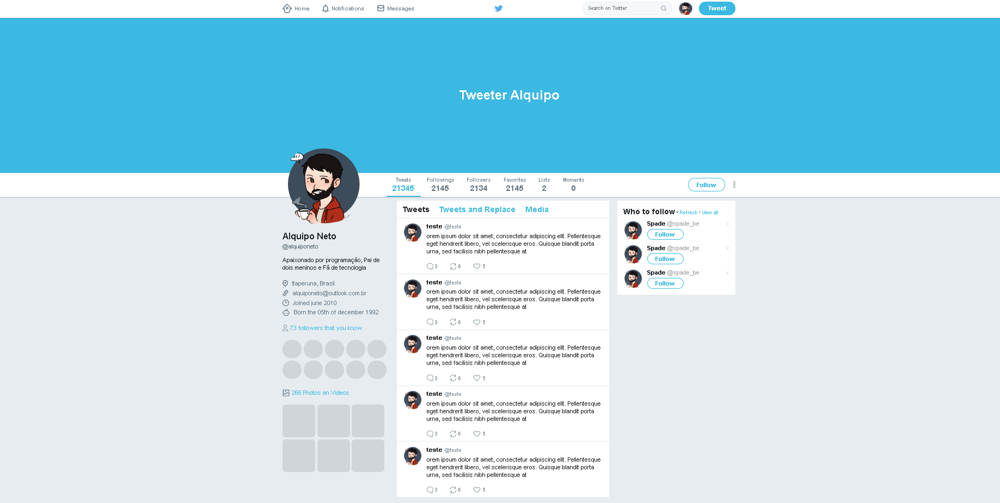

<p align="center">


</p>

<p align="center">
    


<a href="https://www.linkedin.com/in/alquiponeto/">
    
</a>

<a href="https://github.com/Alquipo/CSS3-TwitterClone/commits/master">
    
</a>


</p>

## 🚀 Sobre o Projeto

Este é um projeto que consiste em criar um clone do Perfil do Twitter que foi concebido a partir de uma aula on-line. O projeto foi desenvolvido com CSS3 e HTML5.

## 🎨 Layout

<p align="center">

  
</p>

## 🔨 Tecnologias:

- [HTML 5](https://html.spec.whatwg.org/multipage/)
- [CSS 3](https://www.w3.org/Style/CSS/Overview.en.html)

## 🚀 Como rodar este projeto

Para clonar e executar este aplicativo, você precisará de [Git](https://git-scm.com)

### 🌀 Clonando o repositório

```bash
# Clone este repositório
$ git clone https://github.com/Alquipo/CSS3-TwitterClone

# Acesse a pasta do projeto no terminal/cmd
$ cd CSS3-TwitterClone
```

### 🧭 Rodando a aplicação web

```bash
# Execute a Aplicação
$ Abrir o arquivo index.html


```

## 🤔 Como contribuir para o projeto

- Faça um **fork** do projeto;
- Crie uma nova branch com as suas alterações: `git checkout -b my-feature`
- Salve as alterações e crie uma mensagem de commit contando o que você fez:`git commit -m "feature: My new feature"`
- Envie as suas alterações: `git push origin my-feature`

> Caso tenha alguma dúvida confira este [guia de como contribuir no GitHub](https://github.com/firstcontributions/first-contributions)

## 📝 Licença

Este projeto esta sobe a licença MIT. Veja a [LICENÇA][license] para saber mais.

Feito com ❤️ por Alquipo Neto 👋🏽 [Entre em contato!](https://www.linkedin.com/in/alquiponeto/)

[reactjs]: https://reactjs.org/
[nodejs]: https://nodejs.org/en/
[rs]: https://rocketseat.com.br
[license]: https://opensource.org/licenses/MIT
[desafio2]: https://github.com/Alquipo/GoStack12-desafio-02
[typescript]: https://www.typescriptlang.org/
